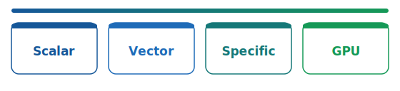

OpenSolvers explores how open-source scientific software runs on real hardware — starting with **RISC-V** boards and the tools that make that practical (EESSI, OpenBLAS, and friends). This site documents what we learn along the way.

## Videos

Walkthroughs on our [YouTube channel](https://www.youtube.com/@opensolvers) — see the full list on the [Videos](videos.html) page.

- **[NaN Linpack on RISC-V (Orange Pi RV2)](https://www.youtube.com/watch?v=W_-8cKA-CCU)** — stock RVV OpenBLAS fails HPL with residual `nan`; gemv_n fix via EESSI + FlexiBLAS (10.53 GFLOP/s PASSED)
- **[1.69× HPL on VisionFive 2](https://www.youtube.com/watch?v=DS4IlzsEq9w)** — U74-tuned OpenBLAS via EESSI and FlexiBLAS (3.13 → 5.28 GFLOP/s)

## What we're working on

We benchmark **scientific libraries** and **applications** on consumer RISC-V boards through the [EESSI](https://www.eessi.io/) stack — from BLAS kernels up to full app runs — swapping fixed OpenBLAS builds via FlexiBLAS without rebuilding downstream code.

## What we optimise on the board

Each RISC-V board exposes several compute paths. We benchmark and tune them independently — often swapping backends at runtime via FlexiBLAS rather than rebuilding every app.

| Path | What it is | Examples on our boards |
| ---- | ---------- | ---------------------- |
| **Scalar** | Scalar ISA and portable C kernels — the correctness baseline | `rv64gc` on VisionFive 2; `OPENBLAS_CORETYPE=RISCV64_GENERIC`; U74 **4×4 DGEMM** tuning |
| **Vector** | ISA vector extensions (RVV) in shared libs | OpenBLAS `RISCV64_ZVL256B` (`rv64gcv` + `Zvl256b`) on X60; [FFTW `r5v`](scientific-libs/fftw.html) **1.06–1.60×** vs scalar; the `gemv_n` bug we fixed |
| **Custom** | Custom ISA extensions beyond standard RVV | X60 **IME** / **XsmtVdot** (`smt.vmadot`) int8 on [RV2](boards/RV2.html) / [F3](boards/F3.html); [ONNX Runtime](apps/onnx.html) int4 via MLAS |
| **GPU** | Integrated Imagination GPUs (OpenCL / Vulkan) | **IMG BXE-4-32 MC1** on [VisionFive 2](boards/VisionFive2.html) (JH7110); **IMG BXE-2-32** on [RV2](boards/RV2.html) / [F3](boards/F3.html) (K1) — present on silicon, **GPGPU benchmarks not yet** |

Recent highlights on the Orange Pi RV2 (SpaceMiT X60, RVV): fixing an OpenBLAS `gemv_n` bug restores correctness across [BLAS](scientific-libs/blas.html), [LAPACK](scientific-libs/lapack.html), [ELPA](scientific-libs/elpa.html), [ScaLAPACK](scientific-libs/scalapack.html), [HPL](apps/hpl.html), and [Quantum ESPRESSO](apps/qe.html). [BLIS](scientific-libs/blis.html) RVV assembly beats patched OpenBLAS **~1.29×** on single-thread DGEMM (N=4096). [FFTW `r5v`](scientific-libs/fftw.html) wins **1.06–1.60×** in isolation but **~0%** inside a real QE SCF; [GROMACS](apps/gromacs.html) sees **1.23×** on isolated `PME 3D-FFT` and **3.31×** whole-app with a hand-written RVV `Force` backend. ONNX `accuracy_level=4` unlocks **9–10×** int4 decode — [ONNX Runtime](apps/onnx.html) / [MLAS](scientific-libs/mlas.html).

## Scientific libs

Library-level probes — performance *and* numerical correctness:

- **[BLAS](scientific-libs/blas.html)** — OpenBLAS improvements (U74 kernel, X60 `gemv_n` / TRSM fixes) and [`OpenBLAS/`](https://github.com/opensolvers/benchmarks/tree/main/OpenBLAS) verification (`bench_dgemm`, `difftest`, `verify_ctrsm`)
- **[BLIS](scientific-libs/blis.html)** — FLAME BLIS `rv64iv` RVV vs patched OpenBLAS; **1.29×** DGEMM at N=4096 (1 thread)
- **[NumPy](scientific-libs/numpy.html)** — `bench_blas.py` DGEMM and `eigvalsh` through the SciPy stack
- **[LAPACK](scientific-libs/lapack.html)** — LAPACK path via NumPy `eigvalsh`
- **[ELPA](scientific-libs/elpa.html)** — dense eigensolver (CP2K / VASP class workloads)
- **[MLAS](scientific-libs/mlas.html)** — ONNX Runtime QNBit int4 GEMM; isolated IME kernel rates on X60
- **[FFTW](scientific-libs/fftw.html)** — RVV `r5v` backend A/B; QE FFT-axis shows ~0% end-to-end despite micro wins
- **[ScaLAPACK](scientific-libs/scalapack.html)** — distributed `PDSYEV`; stock RVV hangs, patched **1.09×**

## Apps

End-to-end application benchmarks on the same boards and EESSI toolchain:

- **[HPL](apps/hpl.html)** — High Performance Linpack; cross-board summary and A/B configs from [opensolvers/benchmarks](https://github.com/opensolvers/benchmarks)
- **[Quantum ESPRESSO](apps/qe.html)** — plane-wave DFT SCF (`pw.x`); whole-application BLAS backend A/B with per-routine timers
- **[ONNX Runtime](apps/onnx.html)** — int4 `MatMulNBits` LLM decode; `accuracy_level=4` unlocks X60 IME (**9–10×**)
- **[GROMACS](apps/gromacs.html)** — PME MD; FFT-axis **1.23×** on `PME 3D-FFT`; RVV `Force` backend **3.31×** whole-app

## Boards

- **[StarFive VisionFive 2](boards/VisionFive2.html)** — JH7110 SoC, 4× SiFive U74 (`rv64gc`). U74 OpenBLAS tuning: HPL **3.13 → 5.28 GFLOP/s**.
- **[Orange Pi RV2](boards/RV2.html)** — SpaceMiT K1, 8× X60 (RVV). Fixed OpenBLAS: HPL **FAILED (`nan`) → 10.53 GFLOP/s**; BLIS DGEMM **1.29×** vs OpenBLAS; GROMACS Force **3.31×**; ELPA **34.81 s** (vs 54.92 s scalar).
- **[Banana Pi F3](boards/F3.html)** — same K1 / X60 SoC, **3.7 GB RAM**. HPL **FAILED (`nan`) → 11.52 GFLOP/s**; NumPy DGEMM up to **17.51 GFLOP/s** on patched RVV.

Use the menu above to jump to a board, app, or scientific lib page.
