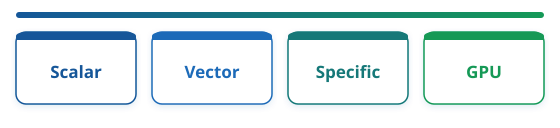

OpenSolvers explores how open-source scientific software runs on real hardware — starting with **RISC-V** boards and the tools that make that practical (EESSI, OpenBLAS, and friends). Alongside classical HPC apps, we also work on **AI inference engines** — [llama.cpp](apps/llamacpp.html), [ONNX Runtime](apps/onnx.html) — tuning the same core kernels (RVV, IME) that scientific codes use. This site documents what we learn along the way. If the work is useful, you can [sponsor OpenSolvers on GitHub](https://github.com/sponsors/opensolvers).

## Why single-board computers?

We work on desk-sized RISC-V SBCs rather than huge supercomputers because the improvements we chase live at the **core** of the software stack — BLAS kernels, vector backends, ISA-specific bugs, and correctness that only shows up on real silicon. That work needs **cores**, not a full machine room. An SBC gives us the same microarchitecture we care about, with a feedback loop measured in hours instead of queue days.

Those core-level fixes and tunings are what HPC already runs at scale: the same OpenBLAS, FlexiBLAS, EESSI modules, and app binaries. Get them right on a board, and the improvement **scales** to a cluster or supercomputer — without needing one to do the engineering.

## Videos

Walkthroughs on our [YouTube channel](https://www.youtube.com/@opensolvers) — see the full list on the [Videos](videos.html) page.

- **[BLIS vs OpenBLAS on RISC-V](https://www.youtube.com/watch?v=zLMkNrl3NNw)** — 1.29× square DGEMM, then 0.35–0.53× HPL (PASSED); panel-heavy vs square
- **[GCC 15.2 mtune on RISC-V](https://www.youtube.com/watch?v=guKeNzHXm70)** — teach `-mtune=spacemit-x60`; canaries −8.7%/−7.7%; DGEMM +3.8%; HPL +0.8%
- **[When RVV FFT Wins 1.6× — 0% in QE](https://www.youtube.com/watch?v=FlumrCEUIBE)** — planner trap: MEASURE micro wins evaporate under `FFTW_ESTIMATE`
- **[Quantum ESPRESSO on BPI-F3](https://www.youtube.com/watch?v=guf9WCAyYPM)** — stock OpenBLAS MPI_ABORTs a real DFT; patched gemv_n → 1.31× SCF (calbec ~2×, fftw flat)
- **[10× ONNX on RISC-V (Orange Pi RV2)](https://www.youtube.com/watch?v=IV3TV57eGAs)** — one missing `accuracy_level=4` unlocks X60 IME; 9.1× / 10.3× on int4 MatMulNBits
- **[3.31× GROMACS on RISC-V (Orange Pi RV2)](https://www.youtube.com/watch?v=COayFhBa0as)** — hand-written RVV Force backend; FFT micro wins dilute until Force owns the wall clock (0.380 → 1.256 ns/day)
- **[NaN Linpack on RISC-V (Orange Pi RV2)](https://www.youtube.com/watch?v=W_-8cKA-CCU)** — stock RVV OpenBLAS fails HPL with residual `nan`; gemv_n fix via EESSI + FlexiBLAS (10.53 GFLOP/s PASSED) — [EESSI blog](https://www.eessi.io/docs/blog/2026/07/12/risc-v-x60-openblas-hpl/)
- **[1.69× HPL on VisionFive 2](https://www.youtube.com/watch?v=DS4IlzsEq9w)** — U74-tuned OpenBLAS via EESSI and FlexiBLAS (3.13 → 5.28 GFLOP/s)

## What we're working on

We benchmark **scientific libraries**, **applications**, and **AI inference engines** on consumer RISC-V boards through the [EESSI](https://www.eessi.io/) stack — from BLAS kernels up to full app runs and LLM decode — swapping fixed OpenBLAS builds via FlexiBLAS without rebuilding downstream code, and staging X60 IME/RVV kernels in our [llama.cpp fork](apps/llamacpp.html).

## What we optimise on the board

Each RISC-V board exposes several compute paths. We benchmark and tune them independently — often swapping backends at runtime via FlexiBLAS rather than rebuilding every app.

| Path | What it is | Examples on our boards |
| ---- | ---------- | ---------------------- |
| **Scalar** | Scalar ISA and portable C kernels — the correctness baseline | `rv64gc` on VisionFive 2; `OPENBLAS_CORETYPE=RISCV64_GENERIC`; U74 **4×4 DGEMM** tuning |
| **Vector** | ISA vector extensions (RVV) in shared libs | OpenBLAS `RISCV64_ZVL256B` (`rv64gcv` + `Zvl256b`) on X60; [FFTW `r5v`](scientific-libs/fftw.html) **1.06–1.60×** vs scalar; the `gemv_n` bug we fixed |
| **Custom** | Custom ISA extensions beyond standard RVV | X60 **IME** / **XsmtVdot** (`smt.vmadot`) int8 on [RV2](boards/RV2.html) / [F3](boards/F3.html); [ONNX Runtime](apps/onnx.html) int4/int8 `MatMulNBits` via MLAS |
| **GPU** | Integrated Imagination GPUs (OpenCL / Vulkan) | **IMG BXE-4-32 MC1** on [VisionFive 2](boards/VisionFive2.html) (JH7110); **IMG BXE-2-32** on [RV2](boards/RV2.html) / [F3](boards/F3.html) (K1) — silicon is compute-capable, but **vendor DDK is BXM-only** (GPGPU closed; open Mesa `pvr` deferred) |

Recent highlights on the Orange Pi RV2 (SpaceMiT X60, RVV): fixing an OpenBLAS `gemv_n` bug restores correctness across [BLAS](scientific-libs/blas.html), [LAPACK](scientific-libs/lapack.html), [ELPA](scientific-libs/elpa.html), [ScaLAPACK](scientific-libs/scalapack.html), [HPL](apps/hpl.html), [Quantum ESPRESSO](apps/qe.html), and [PETSc](scientific-libs/petsc.html) (dense MatMult **~1.70×**; MUMPS 3D n=80 **~1.5×**; stencil SpMV **~3.6×** vs `MatMult`; stock RVV NaN on dense/direct). [NumPy](scientific-libs/numpy.html) re-verify: patched DGEMM **3.13×** / EIGH **1.61×** (stock eig fails). Same FlexiBLAS hub: [Armadillo](scientific-libs/armadillo.html) DGEMM **1.82×**, [R](scientific-libs/r.html) GEMM **1.80×**, [scikit-learn](scientific-libs/sklearn.html) Ridge **1.90×**. [GCC](scientific-libs/gcc.html) X60 mtune (14.3 / 15.2): canaries **−5.0%** / **−6.7%** (14.3) and **−8.7%** / **−7.7%** (15.2) on `fma_chain` / `div_mix`; 15.2 OpenBLAS DGEMM **+2–4%**; HPL **+0.8%**. [BLIS](scientific-libs/blis.html) RVV assembly beats patched OpenBLAS **~1.29×** on single-thread DGEMM (N=4096), but HPL linked to BLIS is correct yet only **0.35–0.53×** OpenBLAS-RVV. [FFTW `r5v`](scientific-libs/fftw.html) wins **1.06–1.60×** in isolation, **~0%** QE drop-in / **~6%** with wisdom; [GROMACS](apps/gromacs.html) sees **1.23×** on isolated `PME 3D-FFT` and **3.31×** whole-app with a hand-written RVV `Force` backend. [LAMMPS](apps/lammps.html) RVV-Kokkos whole-app MD scales to **7.21×** (eam, Kokkos/OpenMP) / **5.94×** (rhodo, MPI) across 8 cores; hand RVV Pair reaches **1.27×** on EAM ([Kokkos](scientific-libs/kokkos.html)). [OpenFOAM](apps/openfoam.html) motorBike: sparse Amul/GS RVV **regresses**; [waLBerla](apps/walberla.html) contiguous HeatEquation **1.64×** / UniformGrid collide **1.54×**. [ONNX Runtime](apps/onnx.html) now ships real decode on Qwen / SmolLM2 / TinyLlama — int4 **~80 ms/tok @4t** (Qwen/SmolLM2), int8 Q8×16 **~140–159 ms**; started with `accuracy_level=4` (**9–10×** FFN) then m1pack + SQ8 — [MLAS](scientific-libs/mlas.html). [llama.cpp](apps/llamacpp.html): 10/10 Q4_0 validated; IME wins prefill (up to **~2.5×**), RVV wins token-gen; Q8_0 **hybrid** restores decode (**6.68** vs **0.83** tg32).

## Scientific libs

Library-level probes — performance *and* numerical correctness:

- **[BLAS](scientific-libs/blas.html)** — OpenBLAS improvements (U74 kernel, X60 `gemv_n` / TRSM fixes) and [`OpenBLAS/`](https://github.com/opensolvers/benchmarks/tree/main/OpenBLAS) verification (`bench_dgemm`, `difftest`, `verify_ctrsm`)
- **[BLIS](scientific-libs/blis.html)** — FLAME BLIS `rv64iv` RVV vs patched OpenBLAS; **1.29×** DGEMM at N=4096 (1 thread); HPL end-to-end **0.35–0.53×** OpenBLAS-RVV
- **[NumPy](scientific-libs/numpy.html)** — DGEMM **3.13×** / EIGH **1.61×** (re-verify); stock eig fails
- **[Armadillo](scientific-libs/armadillo.html)** — C++ template LA; DGEMM **1.82×**, `eig_sym` **1.63×**
- **[R](scientific-libs/r.html)** — `%*%` / `eigen` via FlexiBLAS; GEMM **1.80×**, EIGEN **1.45×**
- **[scikit-learn](scientific-libs/sklearn.html)** — PCA **1.22×**, Ridge **1.90×**
- **[LAPACK](scientific-libs/lapack.html)** — LAPACK path via NumPy `eigvalsh`
- **[ELPA](scientific-libs/elpa.html)** — dense eigensolver (CP2K / VASP class workloads)
- **[MLAS](scientific-libs/mlas.html)** — ONNX Runtime QNBit int4/int8 GEMM; isolated IME kernel rates on X60
- **[FFTW](scientific-libs/fftw.html)** — RVV `r5v` **1.06–1.60×** micro; QE drop-in ~0%, wisdom/MEASURE ~6%, XOR-conj ~2–4%
- **[Kokkos](scientific-libs/kokkos.html)** — LAMMPS OpenMP/Serial; no RVV SIMD abi; hand RVV Pair (LJ micro **~1.64×**, EAM **1.27×**)
- **[PETSc](scientific-libs/petsc.html)** — dense MatMult **~1.70×**; MUMPS 3D n=80 **~1.5×**; hand stencil SpMV **~3.6×** vs `MatMult`
- **[PLUMED](scientific-libs/plumed.html)** — SPRINT / CONTACT_MATRIX FlexiBLAS A/B; patched RVV **1.25×** vs scalar
- **[ScaFaCoS](scientific-libs/scafacos.html)** — P3M Coulomb FFT A/B; r5v **~0.99×** (near-field dilutes)
- **[Voro++](scientific-libs/voro.html)** — RVV auto-vec **~0.99×** (negative control; irregular cell loops)
- **[OSU](scientific-libs/osu.html)** — on-node MPI baseline: **1.12 μs** latency, ~**2 GB/s** uni BW
- **[ScaLAPACK](scientific-libs/scalapack.html)** — distributed `PDSYEV`; stock RVV hangs, patched **1.09×**

## Apps

End-to-end application benchmarks on the same boards and EESSI toolchain:

- **[HPL](apps/hpl.html)** — Classic TOP500 Linpack: dense LU to solve Ax=b. OpenBLAS A/B + BLIS-linked validation from [opensolvers/benchmarks](https://github.com/opensolvers/benchmarks)
- **[Quantum ESPRESSO](apps/qe.html)** — Plane-wave DFT (`pw.x`); BLAS A/B up to **1.46×** on 216-atom cell (RV2 high-mem)
- **[ONNX Runtime](apps/onnx.html)** — real LLM decode via IME `MatMulNBits`: Qwen / SmolLM2 / TinyLlama int4 **~80–156 ms/tok @4t**; int8 Q8×16 **~140–159 ms**; story from `accuracy_level=4` → m1pack → SQ8
- **[llama.cpp](apps/llamacpp.html)** — Lightweight local LLM inference (GGML / GGUF). Q4_0 IME vs RVV; Q8_0 **hybrid** decode; fork [`x60-ime-rvv`](https://github.com/opensolvers/llama.cpp/tree/x60-ime-rvv)
- **[GROMACS](apps/gromacs.html)** — Biomolecular molecular dynamics (proteins, lipids, solvents) with PME. FFT-axis **1.23×**; RVV `Force` **3.31×** whole-app
- **[LAMMPS](apps/lammps.html)** — Classical MD for materials, soft matter, and biomolecules. RVV-Kokkos **7.21×** (eam) / MPI **5.94×** (rhodo); hand RVV EAM **1.27×**
- **[OpenFOAM](apps/openfoam.html)** — Open-source CFD toolbox (finite-volume continuum flow). motorBike `simpleFoam`: auto-vec **~0%**; hand RVV Amul/GS **regress**
- **[waLBerla](apps/walberla.html)** — Lattice Boltzmann / structured-grid PDE framework for fluids and multiphysics. HeatEquation **1.64×**; UniformGrid collide **1.54×**
- **[ESPResSo](apps/espresso.html)** — Soft-matter MD with P3M; FFTW r5v **~1.12×**
- **[MetalWalls](apps/metalwalls.html)** — Electrochemical MD; tip4p FFT/BLAS A/Bs ~**1.00–1.02×**
- **[MODFLOW](apps/modflow.html)** — Groundwater flow via PETSc; FlexiBLAS **~1.00×** (flat)
- **[GCC](scientific-libs/gcc.html)** — GCC 14.3 / 15.2 X60 mtune; canaries **−5–9%**; DGEMM sign flip (14.3 **−3…−7%**, 15.2 **+2–4%**); HPL **+0.8–6.8%**

## Boards

- **[StarFive VisionFive 2](boards/VisionFive2.html)** — JH7110 SoC, 4× SiFive U74 (`rv64gc`). U74 OpenBLAS tuning: HPL **3.13 → 5.28 GFLOP/s**.
- **[Orange Pi RV2](boards/RV2.html)** — SpaceMiT K1, 8× X60 (RVV). Fixed OpenBLAS: HPL **FAILED (`nan`) → 10.53 GFLOP/s**; [QE](apps/qe.html) high-mem **1.46×** (216-atom); [NumPy](scientific-libs/numpy.html) **3.13×** DGEMM; [PETSc](scientific-libs/petsc.html) dense **1.70×** / MUMPS n=80 **~1.5×** / stencil SpMV **3.6×**; [llama.cpp](apps/llamacpp.html) Q8_0 hybrid tg **6.68**; GROMACS Force **3.31×**; **BXE-2-32 GPGPU closed**.
- **[Banana Pi F3](boards/F3.html)** — same K1 / X60 SoC, **3.7 GB RAM**. HPL **FAILED (`nan`) → 11.52 GFLOP/s**; IME peak **~45 GOP/s**; FFTW r5v **1.60×**; GROMACS FFT **1.14×**; LAMMPS Kokkos **6.29×** (eam); NumPy DGEMM **17.51 GFLOP/s**; same GPU closure as RV2.

Use the menu above to jump to a board, app, or scientific lib page.

## Contact

Use the **message box below** for questions, board ideas, or collaboration notes — it goes to the OpenSolvers inbox and we reply by email.

- **Public / bugs:** open an [issue on opensolvers/benchmarks](https://github.com/opensolvers/benchmarks/issues) when a threaded discussion helps.
- **Sponsors:** [sponsor OpenSolvers](https://github.com/sponsors/opensolvers) and use GitHub Sponsors **Contact** after sponsoring — see the [Sponsors](sponsors.html) page.




