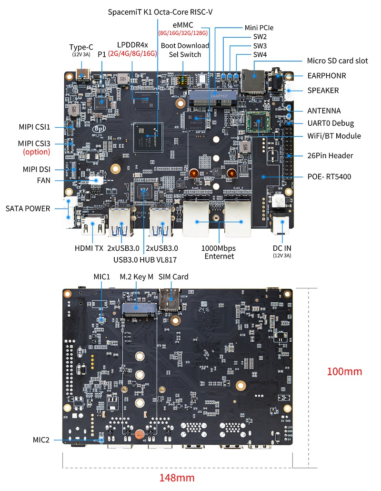

The Banana Pi BPI-F3 is built on the SpaceMiT **K1** SoC: eight **SpacemiT X60** cores at 1.6 GHz (`rv64gcv`, **RVV 1.0, VLEN=256**), integrated **IMG BXE-2-32** GPU (OpenCL 3.0 / Vulkan 1.3), **3.7 GB RAM** — same chip as the [Orange Pi RV2](RV2.html), but half the memory.

Cross-board confirmation from [opensolvers/benchmarks](https://github.com/opensolvers/benchmarks): same `gemv_n` bug, same [easyconfigs#26444](https://github.com/easybuilders/easybuild-easyconfigs/pull/26444) fix, bit-identical residuals where measured.

## IME (Integer Matrix Extension)

Same K1 / X60 silicon as the Orange Pi RV2 — each chip has SpaceMiT's **IME** int8 matrix unit (`smt.vmadot`) on **cluster 0** (cores 0–3, **512 KB shared L2**). The IME is separate from RVV: one instruction accumulates a **4×4 int32** tile from **4×8 int8** operands.

Detailed `ime-bench` numbers were measured on the [RV2](RV2.html) (peak **~42 GOP/s** int8 GEMM vs ~5 GOP/s RVV int8, **~7–8×**). The BPI-F3 has the same IME hardware; pin to core 0 when running [benchmarks/ime](https://github.com/opensolvers/benchmarks/tree/main/ime). End-to-end int4 inference: [ONNX Runtime](../apps/onnx.html) and [MLAS](../scientific-libs/mlas.html).

## HPL

See also the [HPL app overview](../apps/hpl.html).

`HPL.dat` (N=8000, 1×8), EESSI `2025.06-001`. Larger configs (`HPL_big.dat`, `HPL-sweep.dat`) were **skipped** — they need 6.6 GB / 3.2 GB and exceed this board's 3.7 GB RAM.

| Backend | GFLOP/s | Residual | Result |
| ------- | ------- | -------- | ------ |
| Stock EESSI RVV (unpatched) | 11.64 | `nan` | **FAILED** |
| Scalar (`RISCV64_GENERIC`) | 6.52 | 4.63e-03 | PASSED |
| Patched RVV (`gemv_n` fix) | **11.52** | 4.04e-03 | **PASSED** |

**1.77×** scalar → patched vector; patched residual is bit-identical to the RV2.

## Other probes (patched RVV vs scalar)

| Probe | Scalar | Patched RVV | Speedup |
| ----- | ------ | ----------- | ------- |
| [DGEMM](../scientific-libs/dgemm.html) N=2048, 1 core | 1.26 GFLOP/s | 2.96 GFLOP/s | 2.35× |
| [DGEMM](../scientific-libs/dgemm.html) N=4096, 8 threads | — | 17.71 GFLOP/s | — |
| [NumPy](../scientific-libs/numpy.html) DGEMM N=4096 | 4.91 GFLOP/s | 17.51 GFLOP/s | 3.6× |
| [NumPy](../scientific-libs/numpy.html) `eigvalsh` N=2048 | 9.59 s | 5.94 s | 1.6× |
| ELPA `na=3000` | 50.42 s | **34.83 s** | 1.45× |
| [QE](../apps/qe.html) `si-super-64.in` (PWSCF, nbnd=272) | 144.8 s | **110.3 s** | 1.31× |

Stock unpatched RVV: HPL, ELPA, and [Quantum ESPRESSO](../apps/qe.html) fail (`nan` / SCF abort); NumPy `eigvalsh` raises `LinAlgError: Eigenvalues did not converge`.
