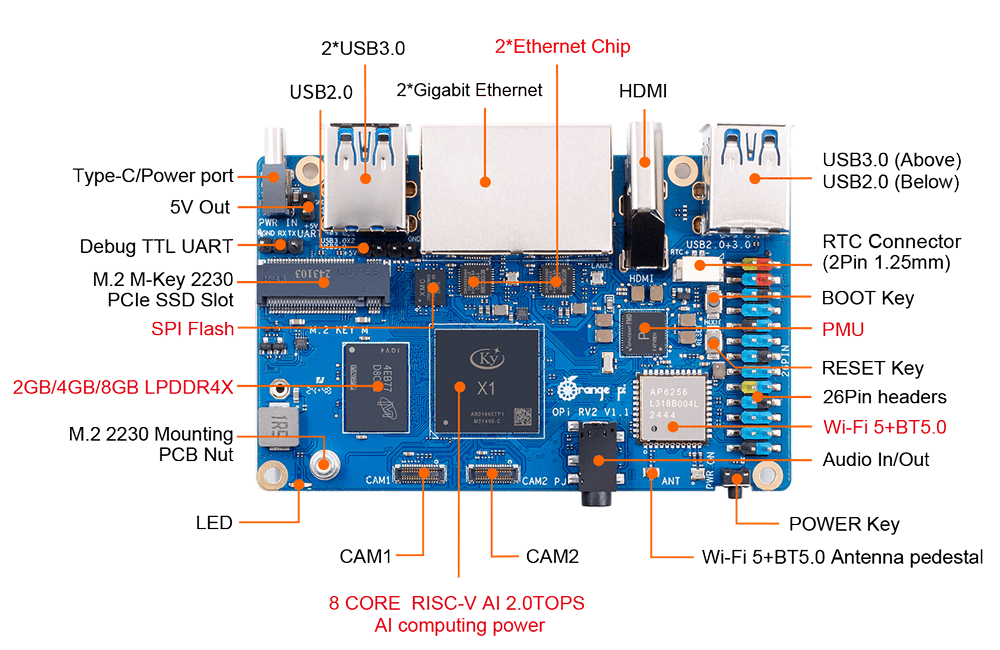
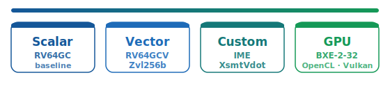

The Orange Pi RV2 is built on the SpaceMiT **K1** SoC: eight **SpacemiT X60** cores at ~1.6 GHz (`rv64gcv`, **RVV 1.0, VLEN=256**), integrated **IMG BXE-2-32** GPU (OpenCL 3.0 / Vulkan 1.3), 8 GB RAM.

## Video walkthrough

**[NaN Linpack on RISC-V: Fixing OpenBLAS gemv_n on Orange Pi RV2 (EESSI)](https://www.youtube.com/watch?v=W_-8cKA-CCU)** — [all videos](../videos.html)

## Compute paths on this board

The K1 SoC exposes all four paths we benchmark: scalar baseline, **RVV** OpenBLAS, **IME** int4 matrix ops (cluster 0), and an integrated **GPU**.

## IME (Integer Matrix Extension)

Besides RVV, each X60 core cluster exposes SpaceMiT's **IME** — a dedicated **int8 matrix unit** via the custom instruction `smt.vmadot`. One `vmadot` fuses a **4×4 int32** tile update from two **4×8 int8** operand tiles; this is the hardware behind the part's quoted AI TOPS rating.

On the K1 the IME sits in **cluster 0 only** (cores **0–3**), with those four cores sharing a **512 KB L2**. Pin IME workloads to a cluster-0 core (`taskset -c 0`).

Microbenchmarks in [opensolvers/benchmarks/ime](https://github.com/opensolvers/benchmarks/tree/main/ime) (`ime-bench`): pure `s8s8s32` GEMM, bit-exact vs a scalar reference, timed against a plain RVV int8 baseline on this board (core 0, 1.6 GHz):

| M×N×K | RVV int8 | IME (`smt.vmadot`) | IME / RVV |
| ----- | -------- | ------------------ | --------- |
| 512×512×512 | 5.2 GOP/s | **39 GOP/s** | **7.5×** |
| 768×768×512 | ~5.2 GOP/s | **42 GOP/s** (peak) | **8.1×** |
| 1024×1024×512 | 5.2 GOP/s | **32 GOP/s** | 6.2× |

Peak **~42 GOP/s** single-core — vs ~5 GOP/s for a straightforward RVV int8 path. End-to-end int4 LLM decode through [ONNX Runtime](../apps/onnx.html) and isolated [MLAS](../scientific-libs/mlas.html) kernel rates use the same IME hardware; see also [papers/x60-ime-block-scale-optimization](https://github.com/opensolvers/benchmarks/blob/main/papers/x60-ime-block-scale-optimization.md) in the benchmarks repo.

### IME1 scale-build prefill optimization (llama.cpp)

llama.cpp's block-scaled Q4_0 kernel (`gemm_kernel_i8i4`) pays a per-block FP scale tax (~31–37% vs raw `s8s8s32`). Patch [`llama-ime1-scalebuild-opt.patch`](https://github.com/opensolvers/benchmarks/blob/main/ime/llama-ime1-scalebuild-opt.patch) rebuilds `As×Bs` scales with `vfmul.vv` (`LOAD_SCALE_4x16_FP16_OPT`) instead of the masked `vfmul.vf` chain.

Isolated interleaved A/B on this board (30 rounds, cluster-0 pinned, performance governor, pp512 = 512³) — [benchmarks/ime](https://github.com/opensolvers/benchmarks/tree/main/ime):

| | stock | scaleopt |
| --- | ---: | ---: |
| median GOP/s | 22.50 | **23.47** |
| range | 22.4–22.7 | 23.2–23.6 |

**+4.3%** (+0.97 GOP/s); scaleopt faster in **30/30** rounds; zero overlap; paired t = 50.3. Bit-exact (`sum`/`sumsq`/`max` identical across three shapes).

The kernel win is real; end-to-end `llama-bench` pp512 on this multi-tenant part is **not resolvable above ±15–20% noise** (see the paper linked above). Decode (`tg`) uses the untouched M1/GEMV path.

## HPL via EESSI

See also the [HPL app overview](../apps/hpl.html).

Unlike the scalar VisionFive 2, the X60 already dispatches OpenBLAS's upstream **RVV** `RISCV64_ZVL256B` kernels from the stock EESSI stack — but OpenBLAS **0.3.30** has a bug in `gemv_n` that zeroes an uninitialized vector register, so stock EESSI **HPL fails with residual `nan`** (it can still report a plausible ~8.5 GFLOP/s; only the residual check reveals the answer is wrong).

End-to-end on real Orange Pi RV2 hardware using [EESSI](https://www.eessi.io/) `2025.06-001` on [`dev.eessi.io/riscv`](https://www.eessi.io/docs/repositories/dev.eessi.io-riscv/). Peak run: **N=20000**, **NB=256**, **2×4** grid (8 MPI ranks).

| | Before | After |
| --- | ------ | ----- |
| HPL (8 cores, N=20000, 2×4) | ~8.5 GFLOP/s, **FAILED** (`nan`) | **10.53 GFLOP/s**, **PASSED** |
| Residual (N=8000, 1×8) | `nan` | 4.04e-03 |

With the fixed backend, scalar-vs-RVV A/B ([benchmarks/hpl](https://github.com/opensolvers/benchmarks/tree/main/hpl)): **6.41 → 11.55 GFLOP/s** (N=8000, 1×8) and **7.38 → 13.41 GFLOP/s** (N=28672, 1×8).

**Before** — stock EESSI OpenBLAS 0.3.30 (RVV `gemv_n` bug). **After** — fixed OpenBLAS built with `TARGET=RISCV64_ZVL256B` and a backported `gemv_n` patch ([easyconfigs#26444](https://github.com/easybuilders/easybuild-easyconfigs/pull/26444)), swapped in via FlexiBLAS — no HPL rebuild.

The fix backports the upstream `gemv_n` correction from OpenBLAS ≥ 0.3.31 ([OpenBLAS#5408](https://github.com/OpenMathLib/OpenBLAS/pull/5408)). A future EESSI bump to OpenBLAS ≥ 0.3.34 should make the patch unnecessary.

### Reproducing the fixed run

1. Set up CVMFS + EESSI on `riscv64` (`EESSI_VERSION_OVERRIDE=2025.06-001`).
2. Baseline: `module load HPL/2.3-foss-2025b` → stock HPL fails residual check (`nan`).
3. Build fixed OpenBLAS: `eb --from-pr 26444 --robot` (via `EESSI-extend` user install, `EASYBUILD_OPTARCH='-march=rv64imafdcv_zvl256b'`).
4. Register the new backend with FlexiBLAS and re-run the same `xhpl`.

Full walkthrough: [EESSI/docs#819](https://github.com/EESSI/docs/pull/819) — *Chasing a NaN: correct RVV HPL on a RISC-V SpaceMiT X60 via EESSI*.

## BLIS vs OpenBLAS

See [BLIS](../scientific-libs/blis.html) — FLAME BLIS `rv64iv` with hand-written RVV assembly vs patched OpenBLAS on the same `bench_dgemm.c`. Single-thread DGEMM at N=4096: **2.95 vs 2.28 GFLOP/s** (**1.29×** BLIS); 8-thread OpenBLAS still leads at large N. TRSM: **2400 cases, 0 fails** on BLIS.

End-to-end [HPL on BLIS](../apps/hpl.html#hpl-on-blis--end-to-end-validation): all **PASSED**, but **0.35–0.53×** OpenBLAS-RVV (best full-memory **5.87 GFLOP/s** at N=25600, 2×4) — the DGEMM win does not carry to Linpack.

## FFTW RVV

See [FFTW](../scientific-libs/fftw.html) — r5v wins **1.06–1.60×** in `tests/bench`, but **~0%** end-to-end in [Quantum ESPRESSO](../apps/qe.html) (`FFTW_ESTIMATE`).

## GROMACS

See [GROMACS](../apps/gromacs.html) — two axes on this board:

| Axis | Result |
| ---- | ------ |
| **FFT** (`libfftw3f` swap) | **1.23×** on isolated `PME 3D-FFT`; ~0% whole-app (`Force` = 90%) |
| **Force** (`rvv-backend/`, `SIMD: RISCV_RVV`) | **4.38×** on `Force`, **3.31×** whole-app (0.380 → **1.256 ns/day**) |

## ScaLAPACK

See [ScaLAPACK](../scientific-libs/scalapack.html) — `PDSYEV` on 2×4 grid: stock RVV **hangs**; patched RVV **107.23 s** vs scalar **116.87 s** (**1.09×**).
