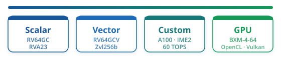

The Banana Pi **BPI-SM10** is a Pico-ITX board around the SpacemiT **K3** SoC (CoM260 / `COM3K316128…`): **8× X100** general-purpose cores (RVA23, RVV 1.0, **VLEN=256**) plus **8× A100** AI cores (**IME2**, **VLEN=1024**, up to **60 TOPS**), integrated **IMG PowerVR BXM-4-64** GPU (Vulkan 1.3 / OpenCL 3.0). Ours runs **Bianbu 4.0.6** with [EESSI](../eessi.html) on [`dev.eessi.io/riscv`](https://www.eessi.io/docs/repositories/dev.eessi.io-riscv/).

**Sponsored by [Banana Pi](https://banana-pi.org/)** — this board was provided by Banana Pi. Product page: [BPI-SM10 (K3-CoM260)](https://banana-pi.org/en/core-board-and-kit/207.html) · [docs](https://docs.banana-pi.org/en/BPI-SM10/BananaPi_BPI-SM10).

## X100 vs A100

K3 is two asymmetric RISC-V clusters. Both implement **RVV 1.0** (A100 is not scalar-only); the AI cores trade general-purpose behaviour for a wider vector unit and **IME2**. Device-tree: `spacemit,x100` (cpu@0–7) vs `spacemit,a100` (cpu@8–15).

| | **X100** (cores 0–7) | **A100** (cores 8–15) |
| --- | --- | --- |
| Role | General-purpose CPU | AI / matrix (**IME2**) |
| Clock (typ.) | up to **2.4 GHz** | up to **2.0 GHz** |
| Clusters | 0–1 (`cluster_cpus` 0–3, 4–7) | 2–3 (`cluster_cpus` 8–11, 12–15) |
| ISA (hart) | `rv64imafdcv`**`h`** + bitmanip / vector crypto | `rv64imafdcv` (no **`h`**) + same vector ext. family |
| Hypervisor | yes (`h`) | no |
| RVV | yes — **VLEN=256** (`vlenb=32`, measured) | yes — **VLEN=1024** (`vlenb=128`, measured on cpu8) |
| Custom | — | **IME2** · up to **60 TOPS** (vendor matrix path) |
| Default Linux scheduling | yes — normal SMP | **fenced** — online in sysfs, but not in a normal task’s affinity mask |

Plain RVV on A100 is often slower than on X100 without vendor IME2 code — wide VLEN is there for the matrix path, not as a drop-in “faster X60.”

### Getting onto A100 (`/proc/set_ai_thread`)

SpacemiT’s kernel keeps general threads on X100 even when A100s are idle. Stock `taskset -c 8` fails with **EINVAL** until the thread is registered as an AI thread:

```bash
echo $$ > /proc/set_ai_thread   # world-writable on Bianbu; unlocks cores 8–15 for this TID
taskset -c 8-15 …               # now affinity works; process stays on A100 for its lifetime
```

On our board `/proc/set_ai_thread` is mode `0222` (write-only). After the write, `Cpus_allowed_list` becomes **8–15** (X100 is no longer available to that task).

**VLEN pitfall:** do not start on X100 (VLEN=256), let `ld.so` cache vector decisions, then migrate to A100 (VLEN=1024) — that pattern can SIGSEGV. Prefer `set_ai_thread` **before** `exec` of the real binary (same pattern as [k3_taskset](https://github.com/zqb-all/k3_taskset) / SpacemiT’s AI runtimes).

For mixed 16-rank jobs (e.g. HPL), ranks 0–7 stay on X100; ranks 8–15 each `echo $TID > /proc/set_ai_thread` then pin to their A100 core before `exec`.

## Compute paths on this board

All four paths we care about are present — and the Custom / GPU story differs from K1 (X60 **IME1** / **BXE-2-32**).



| Path | On SM10 / K3 |
| ---- | ------------ |
| **Scalar** | X100 — `rv64gc` baseline under **RVA23** |
| **Vector** | X100 RVV 1.0 · **Zvl256b** (same VLEN class as X60) |
| **Custom** | A100 cluster — **IME2** matrix path · **60 TOPS** (VLEN=1024) |
| **GPU** | **BXM-4-64** — the SKU SpaceMiT’s proprietary OpenCL/Vulkan DDK actually targets (unlike K1’s BXE) |

Per-board diagrams for the other machines: [VisionFive 2](VisionFive2.html) · [Orange Pi RV2](RV2.html) · [Banana Pi F3](F3.html). Homepage logo is the [combined view](../assets/images/compute-backends.svg).

## Status

Board is on the desk and reachable over SSH with CVMFS + EESSI (`EESSI_VERSION_OVERRIDE=2025.06-001`, software tree `riscv64/generic`). `eessi_archdetect` reports SpacemiT **X100**. Default user threads only see cores **0–7**; A100 work needs [`/proc/set_ai_thread`](#getting-onto-a100-procset_ai_thread).

Benchmark pages (HPL, OpenBLAS, IME2 / llama.cpp, GPU) will land here as A/B numbers come in — same methodology as [RV2](RV2.html) / [F3](F3.html). Until then, treat this page as the hardware / compute-path reference for K3.

## Related

- [Banana Pi BPI-SM10](https://banana-pi.org/en/core-board-and-kit/207.html) — product page (sponsor)
- [Sponsors](../sponsors.html) — how we fund extra RAM SKUs and CI time
- [opensolvers/benchmarks](https://github.com/opensolvers/benchmarks)
