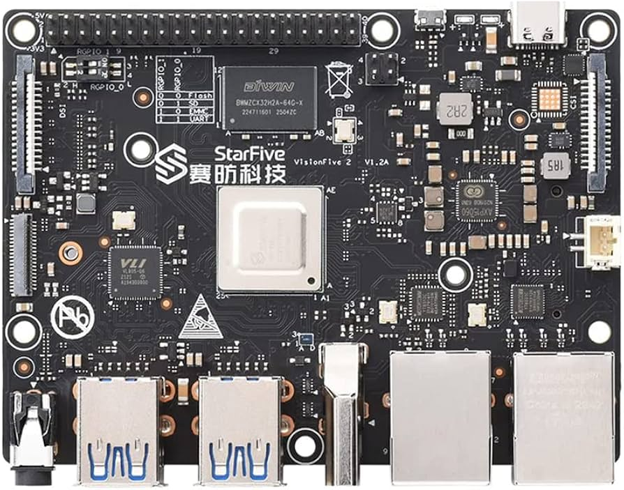
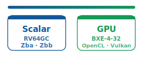

The StarFive VisionFive 2 board is built around the StarFive **JH7110** SoC: four **SiFive U74** cores at 1.5 GHz (`rv64gc`, scalar — no vector extension), integrated **IMG BXE-4-32 MC1** GPU (OpenCL 3.0 / Vulkan 1.2), 8 GB RAM, typically running Ubuntu 24.04.

## Compute paths on this board

The JH7110 has **scalar** CPU cores (U74-tuned OpenBLAS) and an integrated **GPU** — no RVV vector unit or vendor matrix extension.

## HPL via EESSI

See also the [HPL app overview](../apps/hpl.html).

End-to-end benchmark on real VisionFive 2 hardware using [EESSI](https://www.eessi.io/) `2025.06-001` on the RISC-V dev stack [`dev.eessi.io/riscv`](https://www.eessi.io/docs/repositories/dev.eessi.io-riscv/). Problem size **N=10000**, block size **NB=192**, **2×2** process grid (4 MPI ranks).

| | Before | After | Speedup |
| --- | ------ | ----- | ------- |
| HPL (N=10000, 4 cores, 2×2 grid) | **3.13 GFLOP/s** (213 s) | **5.28 GFLOP/s** (126 s) | **1.69×** |

**Before** — stock OpenBLAS 0.3.30 (generic `rv64gc` kernel). **After** — U74-optimized OpenBLAS ([easyconfigs#26436](https://github.com/easybuilders/easybuild-easyconfigs/pull/26436)).

Stock OpenBLAS falls back to the generic `RISCV64_GENERIC` C `2×2` GEMM kernel (~3 GFLOP/s on HPL). A hand-tuned scalar **4×4 DGEMM micro-kernel** for the U74 pipeline ([OpenBLAS#5903](https://github.com/OpenMathLib/OpenBLAS/pull/5903)) lifts single-core DGEMM from ~1.4 to **1.77 GFLOP/s** and 4-core DGEMM to **6.31 GFLOP/s**.

### Reproducing the optimized run

1. Set up CVMFS + EESSI on `riscv64` (`EESSI_VERSION_OVERRIDE=2025.06-001`).
2. Baseline: `module load HPL/2.3-foss-2025b` → `OMP_NUM_THREADS=1 mpirun -np 4 xhpl`.
3. Build tuned OpenBLAS from the easyconfig PR: `eb --from-pr 26436 --robot` (via `EESSI-extend` user install).
4. Register the new backend with FlexiBLAS and re-run the same `xhpl` — no HPL rebuild.

Full walkthrough: [EESSI/docs#818](https://github.com/EESSI/docs/pull/818) — *A 1.7× faster HPL on a RISC-V SiFive U74 via EESSI*.
